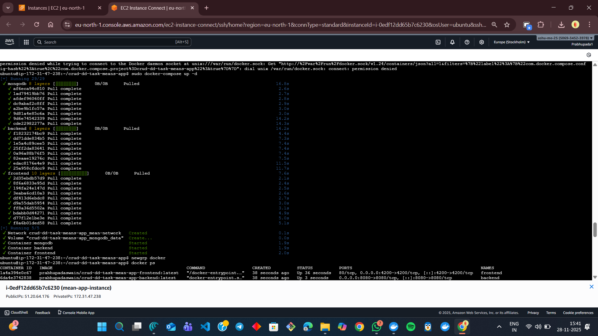
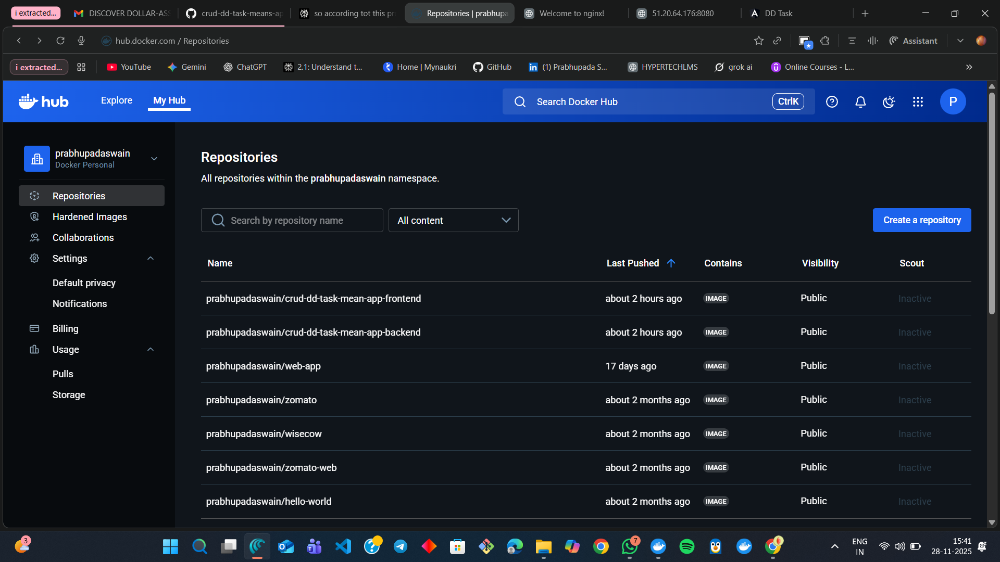

# CRUD MEAN App - Docker Deployment

## Project Overview
This is a full-stack MEAN (MongoDB, Express, Angular, Node.js) application that has been containerized and deployed on AWS EC2.

## Architecture
- **Frontend:** Angular application on port 4200 (served via Nginx on port 80)
- **Backend:** Node.js/Express API on port 8080
- **Database:** MongoDB on port 27017
- **Reverse Proxy:** Nginx on port 80

## Deployment Details
- **Cloud Provider:** AWS EC2
- **Instance Type:** t2.micro
- **OS:** Ubuntu 22.04 LTS
- **IP Address:** 51.20.64.176

## Technologies Used
- Docker & Docker Compose
- Nginx Reverse Proxy
- MongoDB 6.0
- Node.js 18 (Alpine)
- Angular 15

## Setup & Deployment Instructions

### Prerequisites
- Docker and Docker Compose installed
- AWS EC2 instance with Ubuntu 22.04 LTS
- Security groups allowing ports 80, 4200, 8080, 27017

### Local Setup
1. Clone the repository
2. Build Docker images: `docker-compose build`
3. Run locally: `docker-compose up -d`
4. Access at: `http://localhost:4200`

### EC2 Deployment
1. SSH into EC2 instance
2. Install Docker and Docker Compose
3. Clone repository
4. Run `docker-compose up -d`
5. Configure Nginx reverse proxy
6. Access at: `http://51.20.64.176`

## Screenshots

### 1. Docker Build Process

### 2. Docker Images on Docker Hub

### 3. Running Containers

### 4. Nginx Configuration

### 5. Application Frontend (Port 80)

### 6. CRUD Operations

## Deployment Architecture
┌─────────────────────────────────────────┐
│ Nginx (Port 80) │
│ Reverse Proxy │
└─────────────────────────────────────────┘
↓ ↓
┌──────────┐ ┌──────────┐
│ Frontend │ │ Backend │
│ Port 4200│ │ Port 8080│
└──────────┘ └──────────┘
↓ ↓
┌─────────────────────────────┐
│ MongoDB (Port 27017) │
│ Database │
└─────────────────────────────┘

## CI/CD Pipeline
CI/CD implementation can be added using GitHub Actions or Jenkins for automated builds and deployments.

## How to Access
- **Frontend:** http://51.20.64.176
- **Backend API:** http://51.20.64.176:8080
- **Direct Frontend:** http://51.20.64.176:4200

## Testing
1. Open the application in browser
2. Create a new record
3. Update existing records
4. Delete records
5. Verify MongoDB data persistence

## Repository Structure
crud-dd-task-means-app/
├── backend/
│ ├── Dockerfile
│ ├── package.json
│ ├── server.js
│ └── ...
├── frontend/
│ ├── Dockerfile
│ ├── nginx.conf
│ ├── package.json
│ └── ...
├── docker-compose.yml
└── README.md

## Notes
- The application is deployed and running on AWS EC2
- All data is persisted in MongoDB
- Nginx acts as a reverse proxy for frontend and backend
- Docker images are stored on Docker Hub for easy deployment

---

